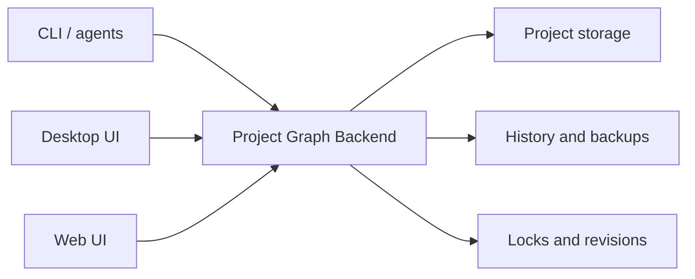

# Backend-First Architecture

Project Graph CLI + Web is converging on one runtime model: a Project Graph backend owns the project state, and CLI, Desktop, and Web connect to it as clients.

The current fork already has a Web backend, an agent-facing CLI, and a desktop live bridge. Backend-first work makes the backend the main route instead of treating Web, CLI, and Desktop as separate products with separate persistence behavior.

## Target Shape



The backend is the source of truth for:

- project list, create, open/import, rename, delete, and blob read/write
- `.prg` decode and encode
- query, patch, validate, import, and export
- project locks, revisions, and conflict checks
- history, backups, restore, and corruption recovery
- capability, version, auth, and LAN-mode metadata
- event delivery for project, lock, history, and server status changes

Today, the Web backend already owns project storage, locks, history, query, patch, export, and blob writes. Backend-owned `validate` and `import` are target-state capabilities: current CLI `server validate` validates a fetched blob locally, and imports still start from file-oriented CLI commands.

Clients may cache display state and in-flight edits for responsiveness, but project persistence and cross-client coordination must round-trip through the backend.

## Client Roles

| Client  | Role                             | Must round-trip through backend                                            | May keep locally                                                  |
| ------- | -------------------------------- | -------------------------------------------------------------------------- | ----------------------------------------------------------------- |
| CLI     | Automation and agent interface.  | project discovery, query, patch, validate, export, writes, revision checks | command arguments, target aliases, temporary output files         |
| Desktop | Rich editing UI for local users. | backend-managed project open/save/history/locks/revisions                  | canvas viewport, selected objects, transient editing state        |
| Web     | Browser client for LAN users.    | all project reads/writes/history/locks/revisions                           | browser client id, project list view filters, optimistic UI state |

Direct local file editing remains supported for compatibility, import/export, and recovery. Shared workflows should prefer backend-managed projects.

## Project Runtime Capability Matrix

Project operations go through `ProjectRuntimeActions`. UI commands should ask for an operation such as backup, import, export, reveal, or folder scan; they should not decide directly whether to call Tauri, browser APIs, or the backend.

| Capability               | Desktop local `.prg`                        | Web browser session                                 | Server-managed project                                      |
| ------------------------ | ------------------------------------------- | --------------------------------------------------- | ----------------------------------------------------------- |
| Project read/write       | Local filesystem provider                   | Backend API for `server:` projects                  | Backend API is source of truth                              |
| Manual backup            | Existing Desktop backup service             | Unsupported for browser-local files                 | `POST /api/projects/:id/backups`                            |
| File import              | Tauri file dialog and local file reads      | Browser `File` picker, then project write via API   | Browser upload path now; explicit backend import API later  |
| Folder scan              | Tauri local folder scanner                  | Browser directory upload converted to `FolderEntry` | Backend machine path scan only when explicitly requested    |
| SVG / PNG export         | Produce `Blob`, then Tauri save dialog      | Produce `Blob`, then browser download               | Client-side export by default; backend-path export explicit |
| Reveal project location  | Tauri shell open for saved local files      | Unsupported                                         | Unsupported; location belongs to backend machine            |
| Reference project lookup | Local same-folder reference compatibility   | Server reference index for `server:` projects       | `references.json` index in backend data directory           |
| Desktop backend control  | Tauri invoke for embedded backend lifecycle | Not available                                       | Backend exposes HTTP API and event stream                   |

The target boundary is strict: only runtime adapters and clearly Desktop-only infrastructure may import `@tauri-apps/*`. Existing direct imports outside that boundary are tracked migration debt and should be reduced when related features are touched.

## Public Runtime Concepts

### Backend Target

A backend target is a reachable Project Graph backend plus capability metadata. Targets can be discovered from a local registry, passed as a URL, or provided by a compatibility live session.

Minimum target metadata:

- `id`
- `kind`: `daemon`, `lan`, or `live`
- `url`
- `apiVersion`
- `authMode`
- `lanMode`
- `dataDirName`
- `localDataDir`, only when the caller is local and the backend explicitly exposes it
- `capabilities`

### Revision Token

`revisionToken` is the public concurrency token for clients. It hides transport-specific details:

- Web HTTP can map it to `ETag` / `If-Match`.
- Live bridge compatibility can map it to numeric document revisions.
- Future event streams can map it to backend event sequence ids or content revisions.

Every project-state read or write should return the latest `revisionToken` when the project has a revision. Every write that mutates existing project content should accept `revisionToken` and reject stale writes with a stable conflict error.

### Error Contract

All client-facing paths should converge on the same error shape:

```json
{
  "ok": false,
  "status": 412,
  "code": "etag_mismatch",
  "error": "Project revision does not match",
  "details": {
    "currentEtag": "\"new-etag\""
  },
  "retry": {
    "action": "refresh_etag",
    "retryable": true
  }
}
```

This example matches the current Web backend and CLI server contract. As the public API moves to `revisionToken`, compatibility responses should either keep these fields or include both `currentEtag` and `currentRevisionToken` until callers have migrated.

The exact transport can differ, but CLI stdout and API responses must stay machine-readable when `--json` or JSON APIs are used.

## Phase 8 Acceptance Scope

Phase 8 is documentation-only. It accepts the architecture contract when:

- the backend ownership boundaries are explicit
- CLI, Desktop, and Web client responsibilities are separated
- `revisionToken` is defined as the future public concurrency concept
- current ETag and live numeric revision compatibility is documented
- later daemon, API, Desktop, event, distribution, and security work is left to later phases

## Migration Path

1. Keep the current Web backend as the first backend implementation.
2. Add daemon commands and local discovery so CLI and Desktop can find a running backend without hard-coded ports.
3. Add unified project runtime APIs and `revisionToken` responses while preserving current ETag behavior.
4. Move Desktop server-project workflows onto the backend API.
5. Add backend events so Desktop and Web can react to external CLI/Web/Desktop changes.
6. Keep the live bridge as a compatibility path for open desktop documents until backend-managed projects are the default shared workflow.

## Non-Goals For The First Backend-First Pass

- Real-time collaborative canvas editing.
- CRDT or object-level multi-writer merges.
- Cloud hosting or account sync.
- Removing direct `.prg` file import/export.
- Replacing the original Desktop editor UX.

The first target is a reliable local/LAN backend with clear ownership of state and predictable automation semantics.
